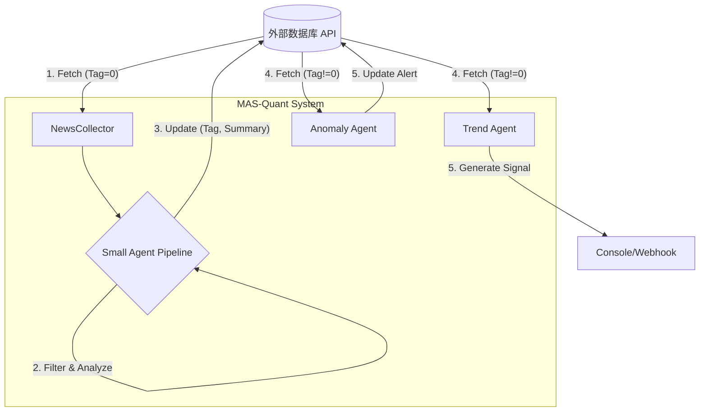

# MAS-Quant: 多智能体加密货币量化场外信息分析系统

<div align="center">基于多智能体架构的数据闭环清洗与量化分析平台</div>

## 📖 目录

- [项目简介](#项目简介)
- [系统架构](#系统架构)
- [核心特性](#核心特性)
- [快速开始](#快速开始)
- [详细文档](#详细文档)
- [数据流闭环](#数据流闭环)
- [常见问题](#常见问题)
- [贡献指南](#贡献指南)
- [许可证](#许可证)

## 🎯 项目简介

MAS-Quant 是一个先进的数据清洗与量化分析闭环系统。它作为一个智能中间件,连接外部原始数据源(CryptoPanic News)和量化决策系统。系统自动从外部 API 拉取原始新闻,通过分层智能体网络进行去噪、摘要、情感打分,并将清洗后的高价值数据回写到外部数据库。随后,宏观分析智能体基于这些已清洗的数据生成趋势信号。

### 核心价值

- 🔄 **数据闭环 (Data Loop)**: Fetch (获取) -> Analyze (分析) -> Update (回写) -> Signal (决策)
- 🤖 **智能化清洗**: 利用 LLM 自动过滤噪音(非相关新闻),对高价值新闻打上情感标签 (Bullish/Bearish)
- ⚡ **极简部署**: 摒弃复杂的微服务架构,采用单进程异步模型,开箱即用
- 🛡️ **无状态设计**: 核心数据存储依赖外部 API,系统本身轻量化,易于横向扩展

## 🏗️ 系统架构

### 核心组件说明

#### 1. 数据采集层 (Collectors)

**NewsCollector**
- **数据源**: 外部 API (fetchCryptoPanic)
- **职责**: 轮询获取 BTC/ETH 的最新新闻
- **智能去重**: 自动跳过已处理(已有 Tag)的新闻,仅处理新增原始数据
- **防并发**: 采用逐条处理机制,防止瞬间请求压垮 LLM 或外部 API

#### 2. 微观处理层 (Small Agents Pipeline)

基于 LangGraph 构建的流水线,负责单条新闻的深度加工:

- **Filter Agent**: 过滤噪音(如无关的山寨币推广、无意义的水文)
- **NLP Agent**:
  - 生成中文摘要 (Summary)
  - 情感定性: 1(Bullish), 2(Neutral), 3(Bearish)
  - 量化打分: 市场影响力 (High/Mid/Low)
- **Writer Node**: 调用外部 API (updatePanicNews),将分析结果(Tag, Summary, Analysis)回写到源数据中

#### 3. 宏观分析层 (Large Agents)

**Trend Agent (趋势分析)**
- **数据源**: 再次调用外部 API,但只筛选带有有效 Tag(已清洗)的新闻
- **逻辑**: 综合过去 24 小时的清洗后数据,生成宏观趋势判断
- **输出**: 打印/推送最终交易信号 (Trend/Confidence)

**Anomaly Agent (异常检测)**
- **职责**: 监控过去 1 小时内清洗后数据的密度和情绪倾向
- **逻辑**: 检测 FUD (恐慌抛售) 或 FOMO (贪婪暴涨) 脉冲
- **反馈**: 一旦发现异常,将警报信息追加写入最新一条新闻的 analysis 字段,实现实时告警回传

## 🔄 数据流闭环



## 🚀 快速开始

### 前置要求

- Python 3.10+
- 外部数据源 API 地址 (fetch/update 接口)
- OpenAI API Key (或兼容的 LLM Key)

### 安装步骤

#### 1. 克隆与环境

```bash
git clone https://github.com/yourusername/mas-quant.git
cd mas-quant

python -m venv venv
source venv/bin/activate  # Windows: venv\Scripts\activate

pip install -r requirements.txt
```

#### 2. 配置环境变量

创建 `.env` 文件:

```ini
# LLM 服务配置
OPENAI_API_KEY="sk-xxxxxxxxxxxxxxxx"
OPENAI_BASE_URL="https://api.openai.com/v1" # 可选

# 调度频率 (秒)
TREND_AGENT_SCHEDULE_SECONDS=900   # 15分钟
ANOMALY_AGENT_SCHEDULE_SECONDS=300 # 5分钟
```

**注意**: 数据源 API 地址已在代码 `src/core/collectors.py` 中默认配置,如需修改请直接编辑该文件。

#### 3. 启动系统

现在只需要运行一个命令:

```bash
uvicorn src.main:app --port 8000 --reload
```

启动后,系统将自动开始:
- 每分钟轮询新新闻
- 清洗并回写数据
- 定期输出宏观趋势信号

## 📚 API 接口说明

系统主要作为消费者运行,但也提供了一些管理接口。

访问文档: http://localhost:8000/docs

| 方法 | 路径 | 描述 |
|------|------|------|
| POST | /http/data_ingest | 手动触发一条数据的处理流程(用于测试) |
| WS | /ws/data_ingest | WebSocket 数据接收端点 |

## ⚠️ 常见问题

<details>
<summary><b>Q: 为什么不需要本地数据库了?</b></summary>

我们采用了 SSOT (Single Source of Truth) 设计模式。外部 API 既是数据源,也是持久化存储。系统将分析结果回写到外部 API 后,Trend Agent 直接从外部 API 读取已处理数据,保证了数据的一致性,并降低了系统维护成本。
</details>

<details>
<summary><b>Q: 如何调整采集频率?</b></summary>

修改 `src/core/collectors.py`:

```python
NEWS_POLL_INTERVAL = 60  # 单位:秒
```
</details>

<details>
<summary><b>Q: 为什么启动时没有立即输出日志?</b></summary>

系统内置了启动延迟以防止并发死锁:
- Collector: 延迟 5-10 秒启动
- Trend Agent: 延迟 30 秒启动

请耐心等待约 30 秒,即可看到完整的处理日志。
</details>


---

## 📄 许可证

本项目采用 **MIT License** 许可证。详见 [LICENSE](LICENSE) 文件。

```
MIT License

Copyright (c) 2025 MAS-Quant Contributors

Permission is hereby granted, free of charge, to any person obtaining a copy
of this software and associated documentation files (the "Software"), to deal
in the Software without restriction, including without limitation the rights
to use, copy, modify, merge, publish, distribute, sublicense, and/or sell
copies of the Software, and to permit persons to whom the Software is
furnished to do so, subject to the following conditions:

The above copyright notice and this permission notice shall be included in all
copies or substantial portions of the Software.

THE SOFTWARE IS PROVIDED "AS IS", WITHOUT WARRANTY OF ANY KIND, EXPRESS OR
IMPLIED, INCLUDING BUT NOT LIMITED TO THE WARRANTIES OF MERCHANTABILITY,
FITNESS FOR A PARTICULAR PURPOSE AND NONINFRINGEMENT. IN NO EVENT SHALL THE
AUTHORS OR COPYRIGHT HOLDERS BE LIABLE FOR ANY CLAIM, DAMAGES OR OTHER
LIABILITY, WHETHER IN AN ACTION OF CONTRACT, TORT OR OTHERWISE, ARISING FROM,
OUT OF OR IN CONNECTION WITH THE SOFTWARE OR THE USE OR OTHER DEALINGS IN THE
SOFTWARE.
```

---

## 🙏 致谢

### 开源项目

感谢以下优秀的开源项目:

- [FastAPI](https://fastapi.tiangolo.com/) - 现代化的 Python Web 框架
- [LangChain](https://www.langchain.com/) - LLM 应用开发框架
- [SQLAlchemy](https://www.sqlalchemy.org/) - Python SQL 工具包
- [FastMCP](https://github.com/jlowin/fastmcp) - MCP 协议实现
- [Uvicorn](https://www.uvicorn.org/) - ASGI 服务器

### 数据提供商

- [NewsData.io](https://newsdata.io/) - 新闻 API 服务
- [Santiment](https://santiment.net/) - 加密货币分析平台


## ⚠️ 免责声明

**重要提示**: 

1. 本软件仅供**教育和研究目的**使用
2. **不构成任何投资建议**,请勿直接用于实际交易
3. 加密货币市场**高度波动**,投资有风险
4. 使用本软件进行交易的所有后果由用户自行承担
5. 开发者不对任何投资损失负责

**在使用本系统进行任何实际交易之前,请**:
- 充分理解加密货币市场的风险
- 咨询专业的财务顾问
- 进行充分的回测和模拟交易
- 建立完善的风险管理策略

---

<div>

**如果这个项目对你有帮助,请给我们一个 ⭐ Star!**

Made with ❤️ by MAS-Quant Team

[⬆ 回到顶部](#mas-quant-多智能体加密货币量化场外信息分析系统)

</div>